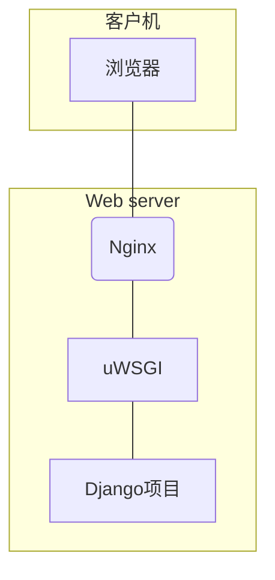

# CentOS7、Nginx、Python、Django项目环境搭建

最近想将自己的一个django项目发布到服务器上，本来网上已经有很多这个架构的文档了，但搭建环境过程中还是遇到了不少的坑，现以文本形式进行记录。

## 环境

服务器：腾讯云服务器

系统：CentOS7

*****


## 流程

### 基础模块安装

参考：[centos7下部署Django](https://www.cnblogs.com/levelksk/p/7921066.html)

```bash
yum install gcc-c++
```
（为centos系统增加编译功能）

~~yum install wget openssl-devel bzip2-devel expat-devel gdbm-devel readline-devel sqlite-devel~~

```bash
yum install wget openssl-devel bzip2-devel expat-devel gdbm-devel readline-devel sqlite-devel libffi-devel
```
（安装这些模块都是为了成功编译安装python3，防止出现各种异常，例如：缺少`libffi-devel`模块会无法安装pip3）

```bash
yum install libxml*
```

(安装这个模块是为了让uwsig支持使用“-x"选项，能通过xml文件启动项目,我后来用的ini文件，这个就没有太大意义了)

****

### Python安装

Linux系统一般都自带Python2，我现在学习和使用的都是Python3的版本，所以先要安装新版本的Python3

在自己习惯的目录下下载安装包，个人喜欢在家目录下：

```bash
wget https://www.python.org/ftp/python/3.7.4/Python-3.7.4.tgz
```

下载完成后解压安装包：

​```bash
tar -zxvf Python-3.7.4.tgz
```

进入解压后的Python-3.7.4文件夹，解析编译安装：

```bash
cd Python-3.7.4
./configure --prefix=/usr/local/python3 --enable-optimizations
make
make install
```

为了方便Python3的使用，并且不影响Python2，建立软连接：

```bash
ln -s /usr/local/python3/bin/python3.7 /usr/bin/python3
ln -s /usr/local/python3/bin/pip3 /usr/bin/pip3
```

（以上两个ln命令是为了方便在终端中直接使用python3和pip3命令）

> ~~在做这一步的时候遇到了找不到pip3目录的情况，我直接将`/usr/local/python3`目录删除，重新安装了一遍Python3就解决了。~~
> 我在新系统重做时又遇到找不到pip3的情况，注意到是缺少了`libffi-devel`,可以将其添加进`基础模块安装`中。

****

### 给python3安装django和uwsgi以及配置启动项目的ini文件

建立网站的存放目录，我按个人习惯建立了`/home/www`目录，进入到目录下：

```bash
mkdir /home/www
cd /home/www/
```

安装django、uwsgi

```bash
pip3 install django
pip3 install uwsgi
```

为了在终端中使用uwsgi命令，建立软连接：

```bash
ln -s /usr/local/python3/bin/uwsgi /usr/bin/uwsgi3
```

（这样就可以在终端使用`uwsgi3`命令调用uwsgi）

将django项目myproject放到`/home/www`目录下，这样就形成了`/home/www/myproject`目录,然后我将该项目的uwsgi启动文件放在`/home/www`目录下，命名为`uwsgi.ini`，编辑内容如下：

```ini
[uwsgi]

# Django相关的配置
# 必须全部为绝对路径
# 项目的路径
chdir           = /home/www/myproject
# Django的wsgi文件
module          = myproject.wsgi

# uwsgi接口,提供给Nginx访问
# file socket 文件接口
socket          = /home/www/myproject.socket
# TCP socket TCP接口，与HTTP配置不同，外部无法访问
#socket          = 127.0.0.1:8997

# 直接做web服务器使用，端口开放，外部可直接访问
http           = 127.0.0.1:8000

# 进程相关的设置
# 主进程
master          = true
# 最大数量的工作进程
processes       = 10
# 退出的时候是否清理环境
vacuum          = true
daemonize=/var/log/spider_uwsgi.log


```

测试一下：

启动uWSGI：

```bash
uwsgi3 -i uwsgi.ini
```

然后就可以通过浏览器访问8000端口看到django项目首页了。

> 附注：
>
> 1. 建议测试完成后注释掉uwsgi.ini文件中的`http = 127.0.0.1:8000`,这样外网就不能直接访问uWSGI服务了。
>
> 2. 如何关闭uWSGI：
>    通过ps，查看uwsgi相关进程
>	`ps aux|grep uwsgi`
>    kill pid会发送SIGTERM，只会导致重启，而不是结束掉。需要发送SIGINT或SIGQUIT，对应着是INT才可以
>    `killall -s INT /usr/local/bin/uwsgi3`

> 我在这一步还遇到了通过uWSGI启动django项目失败的情况，原因是CentOS7自带的sqlite3版本太老不支持django现在的版本，解决办法是更新sqlite3，可参考文章：[更新CentOS的SQLite版本](https://www.cnblogs.com/hupingzhi/p/11300049.html)


****

### 安装Nginx和配置nginx.conf文件

`cd`回到家目录，下载nginx安装包

```bash
wget http://nginx.org/download/nginx-1.17.3.tar.gz
```

下载完成后，执行解压命令：

```bash
tar -zxvf nginx-1.17.3.tar.gz
```

解压完成后cd进入nginx-1.17.3文件夹，执行以下命令：

```bash
./configure
make
make install
```

nginx默认安装在`/user/local/nginx`

由于CentOS7中默认安装了老版本的nginx，为区分版本，方便实用建立软连接：

```bash
ln -s /usr/local/nginx/sbin/nginx /usr/bin/nginx3
```

这样在命令行中直接使用`nginx3`就是运行我们安装的新版本nginx，`nginx`是系统自带老版本nginx

下面我们看一下nginx的配置文件，由于nginx服务可以同时提供多套web服务，我们为了方便对项目的配置，将配套的nginx配置放在对应项目的同目录下，我们在`/home/www/`目录下新建文件`myproject_nginx.conf`,编辑内容如下：

```js
server {
    # 对外提供的访问该项目的端口
    listen      8080;
    # 访问名，填写主机IP或对应解析域名
    server_name 127.0.0.1;
    charset     utf-8;
 
    client_max_body_size 75M;

    location / {
        # uwsgi_pass是uWSGI提供的端口，根据uwsgi.ini文件中的socket配置填写
        # 如果是文件接口：
        uwsgi_pass unix:///home/www/myproject.socket;
        # 如果是TCP接口：
        #uwsgi_pass 127.0.0.1:8997;
        # 该文件为Nginx针对uWSGI的解析文件，在Nginx配置目录下可找到
		include     /usr/local/nginx/conf/uwsgi_params;
    }
    
    location /media/  {
        alias /home/www/lanling/media/;
    }
 	# Django静态文件目录
    location /static/ {
        alias /home/www/lanling/static/;
    }

    error_page   500 502 503 504  /50x.html;
    location = /50x.html {
        root   html;
    }

 
}
```

为了方便`nginx.conf`nginx配置总文件访问`myproject_nginx.conf`nginx子配置文件，将该文件的软连接放到nginx配置目录下：

```bash
ln -s /home/www/myproject_nginx.conf /usr/local/nginx/conf/myproject_nginx.conf
```

这样方便我们修改`nginx.conf`调用`myproject_nginx.conf`,我们在`nginx.conf`文件中的http{}中找位置添加：

```conf
include lanling_nginx.conf;
```

这样在运行nginx的时候就可以加载我们新建的子nginx配置文件了。

运行nginx：

进入/usr/local/nginx/sbin/目录
执行`./nginx -t`命令先检查配置文件是否有错，没有错就执行以下命令：
`./nginx`

> 附注：
> 由于我们之前建立了新版本的nginx在`/usr/bin/`目录下的软连接，我们可以直接在任意目录下通过`nginx3`命令运行nginx：
>
> ```bash
> # 运行nginx：
> nginx3
> # 快速停止或关闭Nginx：
> nginx3 -s stop
> # 正常停止或关闭Nginx：
> nginx3 -s quit
> # 配置文件修改重装载命令：
> nginx3 -s reload
> ```

启动nginx后我们就可以通过浏览器访问该服务器IP地址，访问web服务了。

如果直接访问`http://127.0.0.1/`我们看到的是nginx的默认主页，这是访问的80端口，我们并没有修改。

访问`http://127.0.0.1:8080/`这样就是访问我们在子nginx配置文件中给该项目配置的8080端口了。


****

## 感想反思

1. 基础是在实践应用中打捞的，Linux的基础命令单纯去背还是很难的，量大，每条命令的使用方法也很多，只有在实际应用中才能逐渐熟悉所常用的命令。刚开始的时候或许需要经常查阅搜索，比较麻烦，熟悉了就感到方便了。
2. 在搭建服务器的过程中涉及到多个模块的组合使用，找到一套想要的Linux服务器搭建流程的文章很简单，但系统、软件版本都在随着时间变更发生变化，直接按着别人的流程走一遍很简单，确未必能得到想要的效果，还会发生各种新的错误报警。我们需要捋顺思路，探究问题。
3. 按照文章去搭建服务器，特别是在学习搭建，在虚拟机操作的时候，一遍流程走下来，发现搭建失败会很烦躁，觉得是有遗漏，顺着文档再走一遍，还是有错，如此反复很容易打击学习的积极性，我们要认识到服务器搭建是多模块的组合，认清每一个模块的作用，学会检验模块是否运行正常，结果有错误不代表所有模块都有问题，找打出问题的点，是模块安装问题、模块调用问题还是模块之间的衔接问题。学会查找问题可以很大的提高我们的学习积极性。


[Django+uWSGI+Nginx原理详解](https://www.jianshu.com/p/1c50b15b143a)




