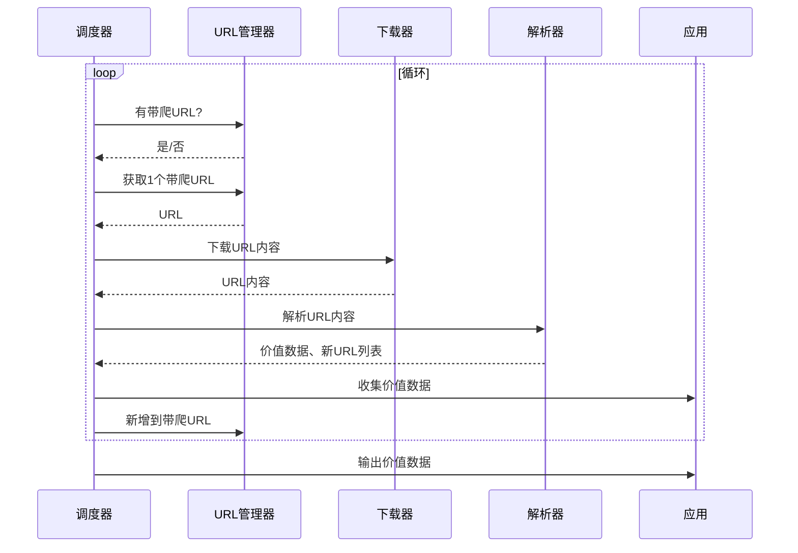

# 爬虫设计
## 前言
最近想申请一个比较短的GitHub用户名，这样在做GitHub Pages时可以有一个比较方便记忆的域名。我在试着申请时发现大部分精短有意义的username都被注册了，纯字母的用户名，1位的就是26个，2位的就有676(262)个，3位的有17576(263)个，……。数量实在太多了，于是我打算写个爬虫，判断符合要求的用户名是否被占用。
## 项目分析
### 参考项目：
[慕课网·Python开发简单爬虫](https://www.imooc.com/learn/563)
### 爬虫运行流程图


### 结构解析

由运行流程图可见，爬虫设计整体分为五个部分：
调度器：负责调度各部分结构，形成逻辑关系。
URL管理器：管理URL列表，处理每一条URL信息在新旧列表中的迁移，新URL信息添加、未访问URL信息的调用。
下载器：根据URL信息，访问对应页面，下载对应页面的HTML信息。
解析器：处理HTML信息，根据同类页面的相同结构，获取自己需要的信息。
应用：调用爬取信息的终端，信息可以是临时存储，然后生成静态页面，也可以将信息存储进数据库，以其它形式调取。`应用`在这一模块在爬虫设计中也可定义为存储、输出模块，毕竟这也是爬虫的一部分，不能单称为应用。

### 页面分析

我们要测试一个用户名是否可用，可以先观察一下：


在注册页面Username框输入测试名，就可以知道该用户名是否可用。

而我们可以知道对应用户的主页url是：`https://github.com/用户名`

例如：


而可用的用户名是未建立的，建立的url访问如下图：


由此可见我们只需要爬取`https://github.com/测试名`的访问结果来确定该用户名是否可以用。

### 测试范围

我希望有一个比较短的用户名，暂定为小于等于3位的纯字母用户名。


## 项目实现

### 贴码注释
#### 调度器 [spider_main.py]

``` python
# -*- coding: UTF-8 -*-
from baike_spider import html_outputer, html_parser, html_downloader, url_manager
# import html_outputer, html_parser, html_downloader, url_manager
class SpiderMain(object):
    #初始化，引入模块
    def __init__(self):
        # url列表模块
        self.urls = url_manager.UrlManager()
        # html页面下载模块
        self.downloader = html_downloader.HtmlDownloader()
        # html页面解析模块
        self.parser = html_parser.HtmlParser()
        # 信息输出模块
        self.outputer = html_outputer.HtmlOutputer()

    def craw(self,root_url):
        count = 1
        # 将初始url添加进新url列表
        # self.urls.add_new_url(root_url)
        # 我们要访问的是固定的url加测试的命名，所以我们直接将数据添加进列表中。
        self.urls.new_url()
        while self.urls.has_new_url():
            try:
                # 获取一条url
                new_url = self.urls.get_new_url()
                # 下载获取url对应页面HTML信息
                html_cont = self.downloader.download(new_url)
                # 解析HTML信息，获取新的url链接表、新的数据信息
                new_data = self.parser.parse(new_url,html_cont)
                print("craw %d : %s : %s" % (count,new_data['title'], new_data['url']))
                # 添加获取的url列表到新url列表
                # self.urls.add_new_urls(new_urls)
       			# 我们要访问的是固定的url加测试的命名，所以我们直接将数据添加进列表中。
                # 将获取的数据添加到数据表
                self.outputer.collect_data(new_data)
                # 访问量达到1000退出循环
                # if count==1000:
                #     break
                count = count + 1
            except:
                print('craw failed')
        # 将数据表输出成HTNL页面
        # self.outputer.output_html()	
        #我们已经将数据存储进数据库，不需要将临时数据生成html文件，因此注释上一条
#主函数
if __name__=="__main__":
    root_url = "https://github.com/"
    obj_spider = SpiderMain()
    obj_spider.craw(root_url)
```

#### url管理器 [url_manager.py]

```python
# -*- coding: UTF-8 -*-
class UrlManager(object):
    # 初始化，建立两个数组
    def __init__(self):
        self.new_urls = set()
        self.old_urls = set()
        
    # 这是我自己添加的一个方法，用来生成我要测试的url并将其添加进新url列表
    def new_url(self):
        for i in range(26):
            n_url = 'https://github.com/' + chr(i + ord('a'))
            self.add_new_url(n_url)
            for j in range(26):
				m_url = 'https://github.com/' + chr(i + ord('a')) + chr(j + ord('a'))
            	self.add_new_url(m_url)
                for k in range(26):
                    d_url = 'https://github.com/' + chr(i + ord('a')) + chr(j + ord('a')) + chr(k + ord('a'))
                    self.add_new_url(d_url)

    # 添加一个url到新url列表
    def add_new_url(self, url):
        if url is None:
            return
        # 该url不在新url列表 并且 不在老url列表
        if url not in self.new_urls and url not in self.old_urls:
            self.new_urls.add(url)

    # 添加一组url到新url列表
    def add_new_urls(self, urls):
        # 要添加的url数组非空 且 长度不为0
        if urls is None or len(urls) == 0:
            return
        for url in urls:
            self.add_new_url(url)

    # 询问当前新url列表长度是否为0，长度为0返回false，长度非0返回true。
    def has_new_url(self):
        return len(self.new_urls) != 0

    # 获取一条新的url
    def get_new_url(self):
        # 获取新url列表的最后一个值，并将其在新url列表中删除。
        new_url = self.new_urls.pop()
        # 将获取的rul值添加到老url列表
        self.old_urls.add(new_url)
        return new_url

```

#### 下载器 [html_downloader.py]

``` python
# -*- coding: UTF-8 -*-
import urllib.request

# HTML下载
class HtmlDownloader(object):
    def download(self, url):
        try:
            # 判断传递过来的url值非空
            if url is None:
                return None
            # 下载url对应HTML
            response = urllib.request.urlopen(url)
            # 判断是否正常访问url获取信息
            if response.getcode() != 200:
                # 访问失败
                return None
            # 访问成功，我们将获取的HTML页面代码返回。
            return response.read()
        except:
            # 访问失败，我们返回一段自己的HTML代码
            html_doc = "<head><meta charset=utf-8><title>特别关注</title></head>"
            return html_doc
```

#### 解析器 [html_parser.py]

``` python
# -*- coding: UTF-8 -*-
from bs4 import BeautifulSoup
import re
import urllib.parse


class HtmlParser(object):
    # 获取页面内新链接的方法
    # def _get_new_urls(self, page_url, soup):
        # new_urls = set()
        # /view/123.htm
        # links = soup.find_all('a',href=re.compile(r"/view/\d+\.htm"))
        # for link in links:
        #     new_url = link['href']
        #     new_full_url = urllib.parse.urljoin(page_url,new_url)
        #     new_urls.add(new_full_url)
        #     return new_urls
	# 由于我们已经指定了要访问的url，不必再页面中解析新的url，故将该方法注释。


    # 获取数据的方法
    def _get_new_data(self, page_url, soup):
        res_data = {}
        title_node = soup.head.title.get_text()
        # 我们获取该页面的title标签内容，以确认该页面对应命名已有人使用
        res_data['title'] = title_node
        res_data['url'] = page_url
        # print("%s : %s"% (title_node,page_url))
        return res_data

    def parse(self, page_url, html_cont):
        if page_url is None or html_cont is None:
            return
        soup = BeautifulSoup(html_cont,'html.parser')
        # soup = BeautifulSoup(html_cont,'html.parser',from_encoding='utf-8')
        # 获取新的链接
        # new_urls = self._get_new_urls(page_url,soup)
        # 获取当前页面数据
        new_data = self._get_new_data(page_url,soup)
        # return new_urls, new_data
        # 原本要返回两项【新url数组、页面获取的数据】，但现在我们只需要返回【页面对应数据】
        return new_data
```

#### 应用 [html_outputer.py]

``` python
# -*- coding: UTF-8 -*-
from baike_spider import sqlite_py
# import sqlite_py

class HtmlOutputer(object):
    # 初始化
    def __init__(self):
        self.sqlitepy = sqlite_py.SqlitePy()
        # 初始化一个数组
        self.datas = []
    # 收集数据
    def collect_data(self, data):
        if data is None:
            return
        # 将数据添加到初始化数组，属于临时存储。程序运行结束，数据就遗失了。
        self.datas.append(data)
        # 我们将数据添加进数据库，这样就可以比较安全的存储了。以后也可以通过数据库查询。
        msql2 = "insert into github_name (name,url) values ('"+ data['title'] +"','"+ data['url'] +"')"
        self.sqlitepy.Insert_test(msql2)

    # 输出数据,用临时存储的数据生成HTML页面，以方便阅读
    def output_html(self):
        fout = open('output.html', 'w')

        style = """
        <style>
        .特别关注{
        background:#00ff00;
        }
        </style>
        """
        fout.write("<html>\n")
        fout.write(style+"\n")
        fout.write("<body>\n")
        fout.write("<table>\n")

        for data in self.datas:
            fout.write("<tr>\n")
            fout.write("<td>%s</td>"% data['url'])
            fout.write("<td>%s</td>\n"% data['title'].encode(encoding='UTF-8',errors='strict').decode('UTF-8','strict'))
            fout.write("</tr>\n")

        fout.write("</table>\n")
        fout.write("</body>\n")
        fout.write("</html>\n")
        fout.close()

```

#### 访问数据库[sqlist_py.py]

``` python
# -*- coding: UTF-8 -*-
# SQLite3 嵌入式 数据库  python内置SQLite3
# 导入驱动
import sqlite3

class SqlitePy(object):
    # 初始化数据库,并建立对应表
    def __init__(self):
        # 连接数据库 若不存在 则自动创建
        mConnection = sqlite3.connect("testsqlite3.db")
        mCursor = mConnection.cursor()
        try:
            msql = """
            create table github_name (
                id integer primary key ,
                name varchar (20),
                url varchar (220))
            """
            mCursor.execute(msql)
        except:
            # sys.exc_info()会返回一个3值原表(type,value,traceback)
            print("表单已经存在")
        finally:
            mConnection.commit()
            mCursor.close()
            mConnection.close()


    # 新增数据
    def Insert_test(self,mysql):
        # 连接数据库
        mConnection = sqlite3.connect("testsqlite3.db")
        mCursor = mConnection.cursor()
        mCursor.execute(mysql)
        mConnection.commit()
        # print("新增一条数据  返回行数:", mCursor.rowcount)
        mCursor.close()
        mConnection.close()

```

### 结果分析
我们访问数据库：


查询数据表：


我们可以发现符合要求的查询并不多，同时及时符合要求，也未必是可用的用户名：


我们查询一下符合要求的内容：


这样可以排除很多，但还是有很多不能用的。

### 得到结果

我最终找到了两个符合要求的用户名`lxi`和`kyg`,当我将测试范围提升到四位，得到的结果就有很多能用的了。三位以下的大部分都已经被占用了。