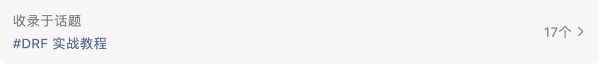

## 最后一篇：结束不想说再见，那就扬帆再次起航！

**收录于话题   [#DRF 实战教程](https://mp.weixin.qq.com/mp/appmsgalbum?__biz=MzA5MzYyNzQ0MQ==&action=getalbum&album_id=1331232826234159105&scene=173#wechat_redirect)**

我们已经成功地用 django-rest-framework 为个人博客添加了完善的 RESTful API 接口，是时候来回顾下 HelloDjango-REST-framework-tutorial 教程共计 **17** 篇的内容都聊了些什么。

## 教程回顾

- 源码：https://github.com/HelloGitHub-Team/HelloDjango-REST-framework-tutorial
- 追梦人物的博客：https://www.zmrenwu.com

点击本文最上面的 #DRF 实战教程 可回顾完整的教程

在 HelloDjango-REST-framework-tutorial 教程的前两篇，我们介绍什么是 RESTful API 以及开发 RESTful API 的框架 django-rest-framework，这是我们进行 API 开发的基础。

第 3、4、5 篇讲解了如何开发博客文章列表接口，接口的开发方式从最简单的视图函数演进到基于类的通用视图，最后演进到视图集，三种方式所需的代码量逐步减少，代码复用程度逐步提高，初步体会到 django-rest-framework 框架的强大之处。我们还通过这个接口的开发了解了序列化器（Serializer）、路由器（Router）的概念和使用方式。

第 6 篇讲解了一行代码增加分页功能，再次体会到 django-rest-framework 框架的强大之处。

第 7、8 篇讲解了文章详情接口开发，我们了解到了如何在序列化器中添加自定义的序列化字段。

第 9、10 篇讲解了博客侧边栏所需数据以及评论接口的开发，重点了解到如何在视图集标准接口外增加额外的接口，即自定义 action。

第 11 篇讲解了如何使用第三方库 drf-haystack 来实现搜索接口，了解到如何利用开源社区来为我们节约复杂功能的开发时间。

第 12 篇讲解了如何实现缓存，同样也是借助开源的第三库 drf-extensions。

第 13 篇讲解了接口版本管理的方式，为以后 API 可能的变更做准备。

第 14 篇讲解了接口的限流，即限制接口的访问频率，防止接口被滥用。

第 15 篇讲解了如何对接口进行单元测试，最大程度保证所开发功能的正确性。

第 16 篇讲解了如何自动化生成接口文档。

总而言之，我们通过一个博客实战项目，讲解了 django-rest-framework 各项核心功能及其用法，涵盖了 django-rest-framework 开发的方方面面。

教程进行到这里，HelloDjango-REST-framework-tutorial 教程就要准备告一段落了，大部分开发中的需求，你都可以通过教程中讲到的知识点，结合 django 以及 django REST framework 的官方文档来实现。

## 结束后的计划

不过，真的要结束了吗？我的回答是没有也不想结束。

对博客来说，我们还可以做这些很酷的功能：

- 支持用户登录，甚至使用 GitHub、新浪微博等第三方应用登录
- 支持多级评论
- 国际化
- 支持邮件订阅，有新的博客就发送邮件提醒订阅者

等等，这些对于其他 Web 系统来说，基本也都是必不可少的。

所以，HelloDjango-REST-framework-tutorial 教程项目会继续以这样的形式继续下去：

围绕着某一个功能进行开发，功能开发完成之后附带输出一篇详细介绍功能实现原理和过程的教程。我希望 HelloDjango-REST-framework-tutorial 教程项目不仅仅是一个教学演示项目，也不仅仅是一个高质量、功能完备的 django 第三方博客应用，而是两者都是！

这些教程会及时通过 HelloGitHub 微信公众号或者 追梦人物的博客 进行更新，敬请关注！

## 新的开篇

此外，空有接口而不去使用，那么接口就成了摆设。用户不可能去看接口返回的原始数据，正确的使用方式应该是使用 JavaScript 框架去消费接口，将接口原始数据在漂亮的 UI 上展示，这就是所谓的前后端分离，大量公司都采用这种开发方式，如果你以找工作为目的而学习 django 的话，怎么能不学习这种开发模式呢？

所以接下来，我们开始进入前端的世界。我们首先会通过一个轻松的实战项目，**学习 Vue 的基本开发、了解 Vue 的核心特性**。然后，我们会使用 Vue 开发一个博客前端 UI，数据则来自本教程开发的 RESTful 接口。

所以还是那句话，关注 HelloGitHub 微信公众号以及 追梦人物的博客，免费学习全栈开发。

