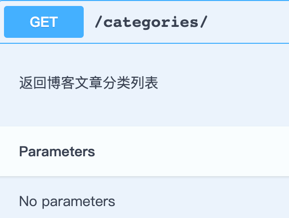
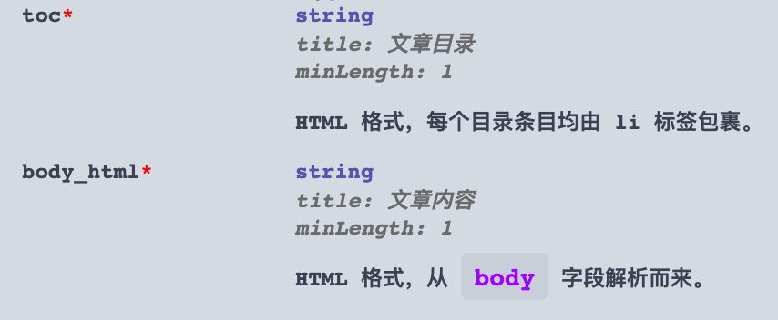
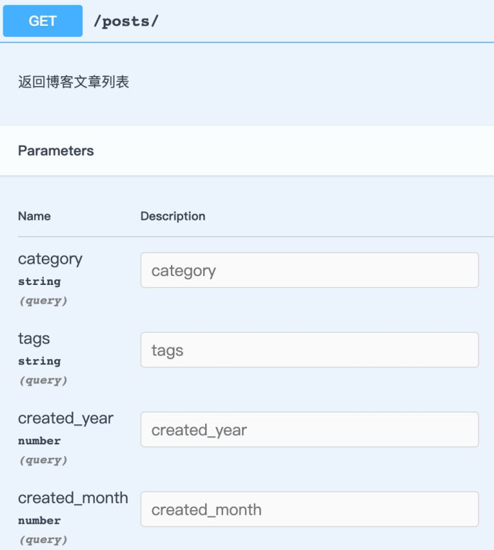
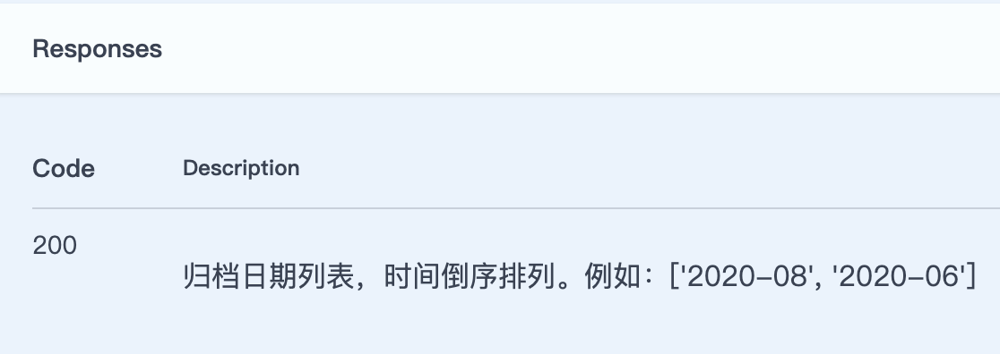

# 第 16 篇：别再手动管理接口文档了

大多数情况下，开发的接口都不是给开发这个接口的人用的，所以如果没有接口文档，别人就无法有哪些接口可以调用，即使知道了接口的 URL，也很难知道接口需要哪些参数，即使知道了这些参数，也可能无法理解这些参数的含义。因此接口文档应该是项目必不可少的配置。

编写接口文档有很多种方式，最为简单直接的方式就是打开一个记事本或者 word 文档，将接口的详细信息和用法写下来，别人就可以参考这个文档来调用接口。这样做虽然简单，但弊端也很明显：一是需要写大量的描述文字，非常枯燥，但其实这些信息在代码中已有体现，有点像是使用自然语言又把代码写了一遍；二是一旦接口有了更新，就必须手动同步更新接口文档，开发人员很容易搞忘这件事，导致接口文档的内容和接口的实际功能不一致。

因为很多接口的信息其实在代码中已有体现，人们自然而然就想到能否直接从写好的代码中自动提取相关信息来生成文档，这样改了代码，接口文档也会自动更新，上面说的两个问题就都可以解决了。

当然写接口文档不是搞文学创作，为了直接从写好的代码中自动提取信息来生成文档，就必须要有一套标准的文档格式，否则工具无法知道要从代码中提取出哪些信息，信息提取之后，也不知道该如何组织这些信息。

经过大家的努力，现在已经有了很多成熟的接口文档标准和生成工具，其中 **[OpenAPI Specification](https://link.zhihu.com/?target=https%3A//swagger.io/specification/)** 就是一个被广泛接收和使用的标准，我们博客接口使用的文档自动化工具，也会基于 OpenAPI 标准从代码中提取文档信息，然后组织为 OpenAPI 的标准格式。

**小贴士：**

大家更为熟悉的，和 OpenAPI 相关的一个名词是 swagger。**[Swagger](https://link.zhihu.com/?target=https%3A//swagger.io/)** 提供一系列免费开源的 OpenAPI 相关的工具，他们背后的公司是 **[SMARTBEAR](https://link.zhihu.com/?target=https%3A//smartbear.com/)**，号称 code quality tools 开发行业的领导者。

## **OpenAPI 介绍**

接口文档不是文学作品，它所需要的内容基本都是固定的。例如对一个 RESTful 风格的接口来说，只需要知道以下这些关键的信息就足够完成对它的调用了。反过来，这些信息也就可以定义一个完整的 RESTful 风格的接口：

- 请求的 HTTP 方法和 URL。
- 接收的参数（包括 URL 中的路径参数、查询参数；HTTP 请求头的参数；HTTP 请求体等参数）。
- 接口返回的内容。

OpenAPI 对以上信息进行了标准化，从而提出了 **[OpenAPI specification](https://link.zhihu.com/?target=https%3A//swagger.io/specification/)**，只要文档内容符合这个标准，OpenAPI 工具就可以对它进行处理，例如可视化文档工具就可以读取文档内容生成 HTML 格式的文档。

**注意：**

OpenAPI specification 目前最新版本是 3，但目前大部分工具对 2 的支持最好，教程中使用的库仅支持 2。

## **drf-yasg**

**[drf-yasg](https://link.zhihu.com/?target=https%3A//github.com/axnsan12/drf-yasg)** 是一个 django 的第三方应用，它可以从 django-rest-framework 框架编写的代码中自动提取接口信息来生成符合 OpenAPI 标准的文档。我们将使用它来生成博客应用的接口文档。

第一步当然是安装 drf-yasg，进入项目根目录，运行命令 ：

### **Command Tab**

```text
Linux/macOS
$ pipenv install drf-yasg

Windows
...\> pipenv install drf-yasg
```

然后将 drf-yasg 添加到 `INSTALLED_APPS` 配置项中：

```text
# filename="blogproject/settings/common.py"
INSTALLED_APPS = [
    # 其它已添加的应用...
  "pure_pagination",  # 分页
    "haystack",  # 搜索
    "drf_yasg", # 文档
]
```

接着使用 drf_yasg 提供的函数来创建一个 django 视图，这个视图将返回 HTML 格式的文档内容，这样我们就可以直接在浏览器查看到博客的接口文档：

```text
# filename="blogproject/urls.py"
from django.urls import include, path, re_path
from drf_yasg import openapi
from drf_yasg.views import get_schema_view
from rest_framework import permissions, routers


schema_view = get_schema_view(
    openapi.Info(
        title="HelloDjango REST framework tutorial API",
        default_version="v1",
        description="HelloDjango REST framework tutorial AP",
        terms_of_service="",
        contact=openapi.Contact(email="zmrenwu@163.com"),
        license=openapi.License(name="GPLv3 License"),
    ),
    public=True,
    permission_classes=(permissions.AllowAny,),
)

urlpatterns = [
   # 其它已注册的 URL 模式...
  
    # 文档
    re_path(
        r"swagger(?P<format>\.json|\.yaml)",
        schema_view.without_ui(cache_timeout=0),
        name="schema-json",
    ),
    path(
        "swagger/",
        schema_view.with_ui("swagger", cache_timeout=0),
        name="schema-swagger-ui",
    ),
    path("redoc/", schema_view.with_ui("redoc", cache_timeout=0), name="schema-redoc"),
]
```

只需要使用 `get_schema_view` 就可以生成一个文档视图，然后我们将这个视图函数映射到了 4 个 URL。

现在进入项目根目录，启动开发服务器：

### **Command Tab**

```text
Linux/macOS
$ pipenv run python manage.py runserver

Windows
...\> pipenv run python manage.py runserver
```

然后访问 [http://127.0.0.1:8000/swagger/](https://link.zhihu.com/?target=http%3A//127.0.0.1%3A8000/swagger/) 或者 [http://127.0.0.1:8000/redoc/](https://link.zhihu.com/?target=http%3A//127.0.0.1%3A8000/redoc/)，你就可以看到 drf-yasg 自动生成的 HTML 格式的接口文档了。如果访问 [http://127.0.0.1:8000/swagger.json](https://link.zhihu.com/?target=http%3A//127.0.0.1%3A8000/swagger.json) 或者 [http://127.0.0.1:8000/swagger.yaml](https://link.zhihu.com/?target=http%3A//127.0.0.1%3A8000/swagger.yaml) 就可以看到原始的 OpenAPI 标准文档，swagger 和 redoc 都是基于这个标准文档来生成可视化的 UI 界面的。

## **完善文档**

drf-yasg 毕竟不是使用人工智能开发的，即使是使用人工智能，也很难做到 100% 的正确，毕竟由人类写的代码可能是千变万化的，工具无法预料到所有可能的情况，一旦它遇到无法处理的地方，自动生成的文档就可能出错，或者生成的内容不符合我们的预期。

我们不妨访问 [http://127.0.0.1:8000/swagger/](https://link.zhihu.com/?target=http%3A//127.0.0.1%3A8000/swagger/) 先来看看没做任何定制化之前生成的效果。可以看到内容大体上是正确的，接口基本上都罗列了出来，但是仔细检查各个接口的内容，就会发现一些问题：

1. GET /api-version/test/ 这个接口是我们用来测试的，不希望它显示在文档里。
2. 基本上没有任何描述信息来说明这个接口的功能。
3. 接口的部分参数也没有描述信息，可能会让接口的使用者无法知道其准确含义。
4. GET /posts/archive/dates/ 这个接口显示的参数是错误的，它不应该接受任何查询参数，接口响应参数也是错误的。
5. GET /posts/{id}/comments/ 这个接口应该还支持分页查询的参数，但生成的文档中没有列出，接口响应参数也是错误的，正确的应该是一个分页后的评论列表，但文档中是单个评论对象。
6. GET /search/ 没有列出搜索参数 text。
7. 多出一个 GET /search/{id}/ 接口，这个接口我们并不需要其被使用，因此也无需在文档列出。

接下来我们就一个个地来解决上面的问题，只需要稍加改变一下 drf-yasg 的默认行为，就能够生成我们预期的文档内容。

### **隐藏不需要的接口**

首先将第 1 点和第 7 点提到的不需要的接口从自动生成的文档中隐藏。

对于 GET /api-version/test/ 这个接口，它对应的视图集是 `ApiVersionTestViewSet`，给这个视图集添加一个 `swagger_schema` 类属性，将值设为 `None`，这样 drf-yasg 就知道忽略这个视图集对应的接口了。

```text
# filename="blog/views.py"
class ApiVersionTestViewSet(viewsets.ViewSet):  # pragma: no cover
    swagger_schema = None
```

隐藏 GET /search/{id}/ 接口的方式稍微有点不同，因为对应的视图集 `PostSearchView` 不只这一个接口，上面的处理方式会把整个视图集的接口都隐藏，我们需要想办法隐藏指定 action 对应的接口。

drf-yasg 提供了一个 `swagger_auto_schema` 装饰器来装饰视图，只需要为装饰器设置 `auto_shema=None` 就可以让 drf-yasg 忽略掉被装饰的视图，具体用法如下：

```text
# filename="blog/views.py"
from django.utils.decorators import method_decorator
from drf_yasg.utils import swagger_auto_schema


@method_decorator(
    name="retrieve",
    decorator=swagger_auto_schema(
        auto_schema=None,
    ),
)
class PostSearchView(HaystackViewSet):
    index_models = [Post]
    serializer_class = PostHaystackSerializer
    throttle_classes = [PostSearchAnonRateThrottle]
```

需要隐藏的接口对应 retrieve 这个 action，因此我们装饰的是这个方法。因为 `PostSearchView` 继承自 `HaystackViewSet`，在代码中并没有显示地定义 `retrieve` 这个方法，而是从父类继承而来，所以我们借助 django 提供的辅助函数 `method_decorator` 非侵入式地为类的某个方法添加装饰器。

现在访问接口文档地址，可以看到不需要的接口已经从文档中隐藏了。

## **添加接口功能描述信息**

接下来解决第 2 个问题，为接口添加必要的功能描述。drf-yasg 支持从视图的 docstring 解析接口对应的描述信息，只要符合指定的格式即可。

先来一个简单例子，为 GET /categories/ 这个接口添加描述信息，找到 `CategoryViewSet` 视图集，添加格式化的 docstring：

```text
# filename="blog/views.py"
class CategoryViewSet(mixins.ListModelMixin, viewsets.GenericViewSet):
    """
    博客文章分类视图集

    list:
    返回博客文章分类列表
    """
```

`CategoryViewSet` 视图集就一个接口，对应的 action 是 `list`，因此 docstring 的格式就像上面那样，文档中的效果如下：



可以看到接口请求 URL 下方多出了我们写的描述内容。其它一些简单的接口都可以用这种方式来添加功能描述信息，留作练习的内容交给你自己了。

tip 描述的内容还支持 Markdown 格式，这样我们可以根据需要写出格式丰富的内容。

对于稍微复杂一点视图集，例如 `PostViewSet`，这个视图集含有多个 action 对应多个接口，功能描述信息的格式差不多是一样的，关键点是指明每个 action 对应的内容：

```text
# filename="blog/views.py"
class PostViewSet(
    mixins.ListModelMixin, mixins.RetrieveModelMixin, viewsets.GenericViewSet
):
    """
    博客文章视图集

    list:
    返回博客文章列表

    retrieve:
    返回博客文章详情

    list_comments:
    返回博客文章下的评论列表

    list_archive_dates:
    返回博客文章归档日期列表
    """
```

### **添加参数说明**

接着我们来完善接口的参数说明文档。通过查看自动生成的文档中各个接口的参数，发现主要有这么几个问题：

- 有些参数没有说明，无法准确知道其含义。
- 有些接口该有的参数，文档中没有列出。
- 有些接口不该有的参数，文档中却列出来了。

例如我们可以看到 GET /posts/{id}/ 这个接口的响应参数，其中大部分有中文信息的描述，我们可以推断，这些说明都是 drf-yasg 自动从定义在 `Post` 模型各字段的 `verbose_name` 参数的值提取的。其中 `toc` 和 body_html 因为不是 `Post` 中定义的字段，所以 drf-yasg 无法知道关于这两个字段的说明。

drf-yasg 是如何知道这个接口会返回哪些响应参数的呢？原理是 drf-yasg 会尝试去解析接口对应的序列化器（Serializer），从序列化器中提取出对应的请求和响应字段（如果序列化器中找不到，它会进一步去序列化器关联的模型中找），因此我们就可以给序列化器中定义的字段添加说明信息。例如我们来给 `toc` 和 body_html 添加 `label` 参数：

```text
# filename="blog/views.py"
class PostRetrieveSerializer(serializers.ModelSerializer):
   toc = serializers.CharField(label="文章目录")
    body_html = serializers.CharField(label="文章内容")
```

访问接口文档地址，找到对应的接口，可以看到文档中这两个字段添加了对应的说明信息，还可以通过 `help_text`（Model 中的字段也支持这个参数）来添加更为详细的描述，例如：

```text
# filename="blog/serializers.py"
class PostRetrieveSerializer(serializers.ModelSerializer):
   toc = serializers.CharField(label="文章目录", help_text="HTML 格式，每个目录条目均由 li 标签包裹。")
    body_html = serializers.CharField(
        label="文章内容", help_text="HTML 格式，从 `body` 字段解析而来。"
    )
```

这样两个字段的含义就非常清晰了，效果如下：



其它一些没有说明信息的字段都可以根据这种方式来添加，只需要找到文档中的参数在代码中对应的来源字段就可以了。除了在序列化器（Serializer）、模型（Model）里面添加。查询过滤参数也是可以这样设置的，例如先来看一下 GET /posts/ 的参数：



可以看到用来过滤文章列表的参数都没有说明，这些字段都定义在 `PostFilter` 中，我们来改一下代码，添加必要的说明信息后再去文档中看看效果吧！

```text
# filename="blog/filters.py"
from .models import Category, Post, Tag

class PostFilter(drf_filters.FilterSet):
    created_year = drf_filters.NumberFilter(
        field_name="created_time", lookup_expr="year", help_text="根据文章发表年份过滤文章列表"
    )
    created_month = drf_filters.NumberFilter(
        field_name="created_time", lookup_expr="month", help_text="根据文章发表月份过滤文章列表"
    )
    category = drf_filters.ModelChoiceFilter(
        queryset=Category.objects.all(),
        help_text="根据分类过滤文章列表",
    )
    tags = drf_filters.ModelMultipleChoiceFilter(
        queryset=Tag.objects.all(),
        help_text="根据标签过滤文章列表",
    )

    class Meta:
        model = Post
        fields = ["category", "tags", "created_year", "created_month"]
```

接着我们来看 GET /posts/archive/dates/ 和 GET /posts/{id}/comments/ 这两个接口。前者文档中显示了一些错误的参数，后者本应该有分页参数，但是文档却没有列出。

先来看 GET /posts/archive/dates/，它对应的 action 是 `list_archive_dates`，由于 action 默认会从它所在的视图集中继承一些属性，而 drf-yasg 会从这些属性去解析接口支持的参数，例如视图集设置了 `filterset_class = PostFilter` 和 `pagination_class=PageNumberPagination`（虽然不在视图集中显示定义，但在全局进行了配置），在解析 `list_archive_dates` 的参数时，drf-yasg 错误地解析到了从视图集继承来的 `PostFilter` 和 `PageNumberPagination`，所以就把这两个类中定义的参数也包含进文档了。

知道了原因，解决方法也就有了，在 `list_archive_dates` action 中把这两个属性设为 `None`，覆盖掉视图集中的默认设置：

```text
# filename="blog/views.py"
class PostViewSet(
    mixins.ListModelMixin, mixins.RetrieveModelMixin, viewsets.GenericViewSet
):
  @action(
        # ...
        filter_backends=None, # 将 filter_backends 设为 None，filterset_class 也就不起作用了。
        pagination_class=None,
    )
    def list_archive_dates(self, request, *args, **kwargs):
        # ...
```

再来看看这个接口，就没有那些错误的参数了。

接着处理 GET /posts/{id}/comments/ 接口，我们需要文档列出分页参数。这个接口对应的 action 是 `list_comment`。从上面的分析来看，这个 action 明明已经指定了 `pagination_class=LimitOffsetPagination`，为什么 drf-yasg 无法自动检测到分页参数呢？原因是这个 action 设置了 `detail=True`。当 `detial=True` 时，drf-yasg 会将这个 action 对应的接口看做获取单个资源的接口，因此它认为分页是不需要的。但实际上我们对这个接口进行了定制，它返回的其实是评论列表。解决办法是应该告诉 drf-yasg，这个接口返回的是列表结果，请去解析列表接口相关的一些参数：

```text
# filename="blog/views.py"
class PostViewSet(
    mixins.ListModelMixin, mixins.RetrieveModelMixin, viewsets.GenericViewSet
):
    @action(
        methods=["GET"],
        detail=True,
        # ...
        suffix="List",  # 将这个 action 返回的结果标记为列表，否则 drf-yasg 会根据 detail=True 误判为这是返回单个资源的接口
        pagination_class=LimitOffsetPagination,
        serializer_class=CommentSerializer,
    )
    def list_comments(self, request, *args, **kwargs):
        # ...
```

但是 drf-yasg 还是不够聪明，当它去解析列表接口可能的参数时，顺便又把 `PostFilter` 中的字段也一并解析了，这是用来过滤博客文章的，显然不能用于过滤评论列表，我们需要将这些无关参数移除，解决方法在处理 GET /posts/archive/dates/ 接口时就讲过了，把 `filter_backends` 设置成 None 就可以了。

## **更正错误的响应参数**

仔细看生成的接口文档，发现有 2 个接口的返回内容是错误的。

一是 GET /posts/{id}/comments/，最初我们发现这个接口文档的响应是一个单一的评论对象，原因我们上面也分析了，drf-yasg 根据 `detail=True` 误地将其作为返回单一资源的接口处理了。随着为其添加更多信息，告诉 drf-yasg 这是一个返回资源列表的接口，问题也就顺便解决了。

二是 GET /posts/archive/dates/，这个接口的返回内容应该是一个日期列表，但是文档中显示的竟然是博客文章列表。drf-yasg 推断的响应类型是正确的，但内容不对。原因也很明显，这个接口对应的 action 是 `list_archive_dates`，drf-yasg 在这个 action 中没有找到解析响应结果的序列化器（Serializer），所以它跑去视图集 `PostViewSet` 中去找了，结果找到了 `PostListSerializer`，然后把这个当成了接口返回的内容进行解析了。

由于这个接口返回的仅仅是一个简单的日期列表，并不涉及到序列化器，因此这里我们不使用指定 `serializer_class` 属性值的方式，而是使用 `swagger_auto_schema` 装饰器，直接告诉 drf-yasg 接口返回的响应：

```text
# filename="blog/views.py"
class PostViewSet(
    mixins.ListModelMixin, mixins.RetrieveModelMixin, viewsets.GenericViewSet
):
  @swagger_auto_schema(responses={200: "归档日期列表，时间倒序排列。例如：['2020-08', '2020-06']"})
    @action(
        methods=["GET"],
        detail=False,
        url_path="archive/dates",
        url_name="archive-date",
        filter_backends=None,
        pagination_class=None,
    )
    def list_archive_dates(self, request, *args, **kwargs):
        # ...
```

`responses` 参数的值是一个字典，字典的键是 HTTP 响应码，值可以是一个序列化器，这样 drf-yasg 会拿这个序列化器去解析接口响应的参数；也可以是一个字符串，drf-yasg 会把字符串直接当做接口响应结果写入文档中。看看修改后的效果：



至此，我们就有了一套比较完善的博客接口文档了，而且大部分内容均由 drf-yasg 为我们自动生成，省去了不少手写文档的麻烦。

## **参考资料**

以下是教程中用到的一些参考：

- **[OpenAPI Specification](https://link.zhihu.com/?target=https%3A//swagger.io/resources/open-api/)**
- **[drf-yasg 源码仓库](https://link.zhihu.com/?target=https%3A//github.com/axnsan12/drf-yasg)**
- **[drf-yasg 官方文档](https://link.zhihu.com/?target=https%3A//drf-yasg.readthedocs.io/en/stable/)**

**小贴士：**

drf-yasg 的官方文档对于这个库的使用方法写的不是很清晰，这篇文章中列出的一些用法都是从源码中看出来的。如果你在使用过程中遇到了问题，首先尝试分析问题的原因，然后顺藤摸瓜去找到相关的源码，看看库的内部是如何处理你所遇到的问题的，这样就可以针对性地给出解决方案了，这篇教程中列出的很多问题以及最后给出的解决方案，都是使用的这种方式。