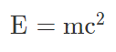
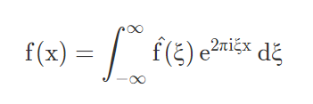
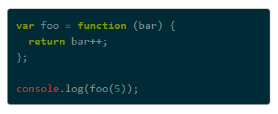
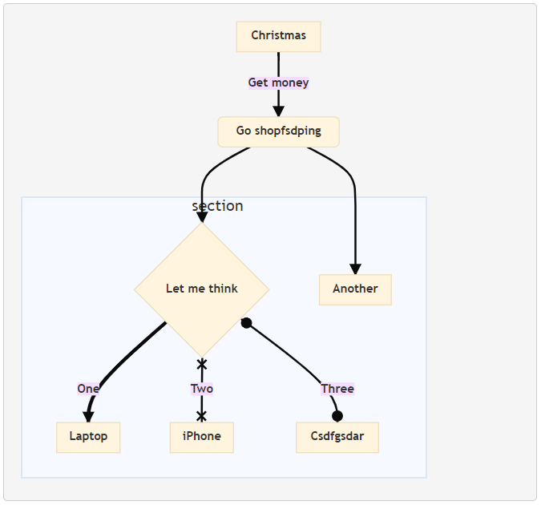

# markdown-it使用记录

## 首先了解一下什么是markdown

Markdown是一种[轻量级标记语言](https://baike.baidu.com/item/轻量级标记语言/52671915)，创始人为约翰·格鲁伯（英语：John Gruber）。 它允许人们使用易读易写的纯文本格式编写文档，然后转换成有效的XHTML（或者HTML）文档。这种语言吸收了很多在电子邮件中已有的纯文本标记的特性。

由于Markdown的轻量化、易读易写特性，并且对于图片，图表、数学式都有支持，目前许多网站都广泛使用Markdown来撰写帮助文档或是用于论坛上发表消息。 如[GitHub](https://baike.baidu.com/item/GitHub/10145341)、[Reddit](https://baike.baidu.com/item/Reddit/1272010)、[Diaspora](https://baike.baidu.com/item/Diaspora/10726893)、[Stack Exchange](https://baike.baidu.com/item/Stack Exchange/13777796)、[OpenStreetMap](https://baike.baidu.com/item/OpenStreetMap/3171606) 、[SourceForge](https://baike.baidu.com/item/SourceForge/6562141)、[简书](https://baike.baidu.com/item/简书/5782216)等，甚至还能被使用来撰写[电子书](https://baike.baidu.com/item/电子书/346054)。


## markdown-it是什么？

markdown-it是markdown文本的解析器，用来将markdown文本解析成HTML文本展示在页面中。

markdown-it 是一个辅助解析 markdown 的库，可以完成从 # test 到 <h1>test</h1> 的转换。 它同时支持[浏览器](http://www.fly63.com/tag/浏览器)环境和 Node 环境

## 我为什么选择markdown-it

首先，markdown是一种很高效的文本编辑器，相比word可以灵活修改指定文本样式，操作繁复，想要统一文本格式是一件比较麻烦的事，而markdown只需要指定语法，不同语法对应解析格式不同，展示样式由解析器及配置决定，更方便统一样式。

而且，markdown与HTML页面更佳亲和，现在很多网站文档与博客，都在使用markdown。

但现在网络上的markdown解析器，无论是安装在Windows、Mac或linux平台上的编辑器，还是网页编辑器或是用于开发的markdown解析器，都存在一些语法支持上的差异，除基本语法外，很多平台都还会引用一些高效常用比较普及的插件，还可以添加自己设计的插件，因此导致很多语句在不同平台解析器下是不兼容的。

我想搭建一套网站，以博客形式做文章发布，希望可以以多种形式做信息展示，需要用到的语法会有些多，我浏览过一些比较常见的markdown解析器，支持的语法各有不同，也不能重叠使用，很多新奇的语法也很喜欢。而`markdown-it`是一款比较基础的markdown解析器，支持很多高效插件，也支持自主开发新插件，有很多解析器也是以它为基础的开发的。

既是对开发的爱好，也是对新插件原理的探索，我选择了`markdown-it`做自己网站markdown解析器的基础。


### 常用语法

markdown-it支持的基本语法，无需安装其它插件即可使用：

| **Markdown语法**          | **详解**                  | **快捷键**         | **效果**                                                     |
| ------------------------- | ------------------------- | ------------------ | ------------------------------------------------------------ |
| `*斜体*`                   |                           | Ctrl/⌘ + I         | *斜体*                                                       |
| `**粗体**`                  |                           | Ctrl/⌘ + B         | **粗体**                                                     |
| `# 一级标题`                | "#"后需加空格             |                    |                                                              |
| `## 二级标题`               | 以此类推三级标题为三个“#” |                    |                                                              |
| `[链接](http://a)`          | “[]”间为显示的超文本      | Ctrl/⌘ + K         | [链接](https://baike.baidu.com/item/链接/2665501)            |
| `` | “[]”间为图片名            | Ctrl/⌘ + Shift + I |  |
| `> 引用`                    | ">"后需加空格             | Ctrl + Q           |                                                              |
| `* 无序列表`                |                           | Ctrl + L           |                                                              |
| `1. 有序列表`               |                           |                    |                                                              |
| `---`                       | 水平分割线                |                    | ————                                                         |
| \`内联代码\` 的使用        |                           | Ctrl/⌘ + Shift + K |                                                              |
| \`\`\`代码块\`\`\`              |                           |                    |                                                              |
| `…… `                       |                           |                    |                                                              |

## 常用插件介绍：

1. ### markdown-it-abbr

简介：用于为[markdown-it](https://github.com/markdown-it/markdown-it) markdown解析器的缩写（`<abbr>`）标签插件。

Markdown:

```
*[HTML]: Hyper Text Markup Language
*[W3C]:  World Wide Web Consortium
The HTML specification
is maintained by the W3C.
```

HTML:

```html
<p>The <abbr title="Hyper Text Markup Language">HTML</abbr> specification
is maintained by the <abbr title="World Wide Web Consortium">W3C</abbr>.</p>
```
安装：`npm install markdown-it-abbr --save`

------------------------------------------------------------------------


2. ### markdown-it-container

简介：用于为[markdown-it](https://github.com/markdown-it/markdown-it) markdown解析器创建块级自定义容器的插件。

Markdown:

```
::: warning
*here be dragons*
:::
```

HTML:

```html
<div class="warning">
<em>here be dragons</em>
</div>
```

安装：`npm install markdown-it-container --save`


------------------------------------------------------------------------

3. ### markdown-it-deflist

简介：[markdown-it](https://github.com/markdown-it/markdown-it) markdown解析器的定义列表（`<dl>`）标签插件。

```
Term 1

:   Definition 1
with lazy continuation.

Term 2 with *inline markup*

:   Definition 2

        { some code, part of Definition 2 }
    
    Third paragraph of definition 2.
```
```html
<dl>
<dt>Term 1</dt>
<dd>
<p>Definition 1<br />
with lazy continuation.</p>
</dd>
<dt>Term 2 with <em>inline markup</em></dt>
<dd>
<p>Definition 2</p>
<pre><code>  { some code, part of Definition 2 }
</code></pre>
<p>Third paragraph of definition 2.</p>
</dd>
</dl>
```
安装：`npm install markdown-it-deflist --save`

------------------------------------------------------------------------


4. ### markdown-it-emoji

Markdown:

```markdown
:-) :-( 8-) ;)
```
HTML:
```html
 
 
 

```
安装：`npm install markdown-it-emoji --save`

------------------------------------------------------------------------


5. ### markdown-it-footnote


    简介：用于markdown-it markdown解析器的Footnotes插件。脚注插件，底部注释

  **Normal footnote    普通脚注**:

  ```markdown
  Here is a footnote reference,[^1] and another.[^longnote]
  
  [^1]: Here is the footnote.
  
  [^longnote]: Here's one with multiple blocks.
  
      Subsequent paragraphs are indented to show that they
  belong to the previous footnote.
  ```

  html:

  ```html
  <p>Here is a footnote reference,<sup class="footnote-ref"><a href="#fn1" id="fnref1">[1]</a></sup> and another.<sup class="footnote-ref"><a href="#fn2" id="fnref2">[2]</a></sup></p>
  <p>This paragraph won’t be part of the note, because it
  isn’t indented.</p>
  <hr class="footnotes-sep">
  <section class="footnotes">
  <ol class="footnotes-list">
  <li id="fn1"  class="footnote-item"><p>Here is the footnote. <a href="#fnref1" class="footnote-backref">↩</a></p>
  </li>
  <li id="fn2"  class="footnote-item"><p>Here’s one with multiple blocks.</p>
  <p>Subsequent paragraphs are indented to show that they
  belong to the previous footnote. <a href="#fnref2" class="footnote-backref">↩</a></p>
  </li>
  </ol>
  </section>
  ```

  **Inline footnote    行内脚注**:

  ```markdown
  Here is an inline note.^[Inlines notes are easier to write, since
  you don't have to pick an identifier and move down to type the
  note.]
  ```

  html:

  ```html
  <p>Here is an inline note.<sup class="footnote-ref"><a href="#fn1" id="fnref1">[1]</a></sup></p>
  <hr class="footnotes-sep">
  <section class="footnotes">
  <ol class="footnotes-list">
  <li id="fn1"  class="footnote-item"><p>Inlines notes are easier to write, since
  you don’t have to pick an identifier and move down to type the
  note. <a href="#fnref1" class="footnote-backref">↩</a></p>
  </li>
  </ol>
  </section>
  ```
  安装:`npm install markdown-it-footnote --save`


------------------------------------------------------------------------

6. ### markdown-it-ins

简介：下划线插件
Markdown:
```markdown
++inserted++
```
HTML:
```html
<ins>inserted</ins>
```
安装:`npm install markdown-it-ins --save`

------------------------------------------------------------------------

7. ### markdown-it-mark

简介：<mark>markdown-it markdown解析器的标签插件。
Markdown:
```markdown
==marked==
```
HTML:
```html
<mark>marked</mark>
```
安装:`npm install markdown-it-mark --save`

------------------------------------------------------------------------


8. ### markdown-it-sub

简介：用于[markdown-it](https://github.com/markdown-it/markdown-it) markdown解析器的下标（`<sub>`）标签插件。
Markdown:

```markdown
H~2~0
```
HTML:
```html
H<sub>2</sub>O
```


安装:`npm install markdown-it-sub --save`

------------------------------------------------------------------------


9. ### markdown-it-sup

简介：[markdown-it](https://github.com/markdown-it/markdown-it) markdown解析器的上标（`<sup>`）标签插件。
Markdown:

```markdown
29^th^
```
HTML:
```html
29<sup>th</sup>
```


安装:`npm install markdown-it-sup --save`

------------------------------------------------------------------------


10. ### markdown-it-imsize

简介：一个markdown-it插件，用于指定大小的图像标记。该插件会使markdown-it的原始图像渲染器过载。
Markdown:

```markdown

```
HTML:
```html
<p></p>
```

安装:`npm install markdown-it-imsize --save`


------------------------------------------------------------------------


11. ### markdown-it-attrs

简介：使用`{.class #identifier attr=value attr2="spaced value"}`大括号将类，标识符和属性添加到markdown中，类似于[pandoc的header属性](http://pandoc.org/README.html#extension-header_attributes)。
Markdown:

```markdown
# header {.style-me}
paragraph {data-toggle=modal}
```
HTML:
```html
<h1 class="style-me">header</h1>
<p data-toggle="modal">paragraph</p>
```

也可以与内联元素一起使用：

```
paragraph *style me*{.red} more text
```

输出：

```
<p>paragraph <em class="red">style me</em> more text</p>
```

和围栏代码块：

```
​```python {data=asdf}
nums = [x for x in range(10)]
​```
```

输出：

```
<pre><code data="asdf" class="language-python">
nums = [x for x in range(10)]
</code></pre>
```


您可以使用“..”作为“css module=`”的简写：

```
Use the css-module green on this paragraph. {..green}
```

输出：

```
<p css-module="green">Use the css-module green on this paragraph.</p>
```


还可以与[markdown it bracketed span](https://github.com/mb21/markdown-it-bracketed-spans)插件结合使用（然后安装并加载）：

```
paragraph with [a style me span]{.red}
```

输出：

```
<p>paragraph with <span class="red">a style me span</span></p>
```

安装:`npm install --save markdown-it-attrs`

------------------------------------------------------------------------


12. ### markdown-it-kbd

简介：[markdown-it](https://github.com/markdown-it/markdown-it)击键插件
Markdown:

```markdown
[[x]]
```
HTML:
```html
<kbd>x</kbd>
```

安装:`npm install --save markdown-it-kbd`


------------------------------------------------------------------------


13. ### markdown-it-math	加	KaTeX

[](https://katex.org/)

简介：`markdown-it-math`是一个通用的[markdown-it](https://github.com/markdown-it/markdown-it)数学插件。

​			`KaTeX`是一个快速，易于使用的JavaScript库，用于在网络上进行TeX数学渲染。

​			原本我使用`markdown-it-katex`做数学渲染，但由于其与`KaTex`并不属于同一组织，更新不及时渲染出现了偏差，我改用了`markdown-it-math`,而`markdown-it-math`渲染效果美观较差，我便将其与`KaTex`合并使用：

安装：

```shell
npm install markdown-it-math --save
npm install katex --save
```

配置：

```js
const katex = require('katex');
var md = require('markdown-it')()
		.use(require('markdown-it-math'), {	// 数学公式渲染
	              inlineRenderer: function(str) {
	                  return katex.renderToString(str, {throwOnError: false});
	              },
	              blockRenderer: function(str) {
	                  return katex.renderToString(str, {throwOnError: false,displayMode:true});
	              }
	          });
```

页面引入样式：

```html
<link rel="stylesheet" href="https://cdn.jsdelivr.net/npm/katex@0.10.1/dist/katex.min.css">
```


Markdown行内引用:

```markdown
$$E=mc^2$$
```
输出效果:


Markdown多行公式
```markdown
$$$
f(x) = \int_{-\infty}^\infty
    \hat f(\xi)\,e^{2 \pi i \xi x}
    \,d\xi
$$$
```
输出效果：


------------------------------------------------------------------------


14. ### highlight.js

简介：代码块高亮，`markdown-it`本身支持代码块渲染，但颜色单一，没有配色，阅读效果不佳，我们通过`markdang-it`的配置选项进行配置，通过`highlight.js`进行装饰，使得代码块高亮，阅读效果更佳。

安装：`npm install --save highlight.js`

配置：

```js
var hljs = require('highlight.js');
// hljs 只针对pre code 里面的样式
 
hljs.registerLanguage('actionscript', require('highlight.js/lib/languages/actionscript'));
hljs.registerLanguage('apache',       require('highlight.js/lib/languages/apache'));
hljs.registerLanguage('armasm',       require('highlight.js/lib/languages/armasm'));
hljs.registerLanguage('xml',          require('highlight.js/lib/languages/xml'));
hljs.registerLanguage('asciidoc',     require('highlight.js/lib//languages/asciidoc'));
hljs.registerLanguage('avrasm',       require('highlight.js/lib/languages/avrasm'));
hljs.registerLanguage('bash',         require('highlight.js/lib/languages/bash'));
hljs.registerLanguage('clojure',      require('highlight.js/lib/languages/clojure'));
hljs.registerLanguage('cmake',        require('highlight.js/lib/languages/cmake'));
hljs.registerLanguage('coffeescript', require('highlight.js/lib/languages/coffeescript'));
hljs.registerLanguage('cpp',          require('highlight.js/lib/languages/cpp'));
hljs.registerLanguage('arduino',      require('highlight.js/lib/languages/arduino'));
hljs.registerLanguage('css',          require('highlight.js/lib/languages/css'));
hljs.registerLanguage('diff',         require('highlight.js/lib/languages/diff'));
hljs.registerLanguage('django',       require('highlight.js/lib/languages/django'));
hljs.registerLanguage('dockerfile',   require('highlight.js/lib/languages/dockerfile'));
hljs.registerLanguage('ruby',         require('highlight.js/lib/languages/ruby'));
hljs.registerLanguage('fortran',      require('highlight.js/lib/languages/fortran'));
hljs.registerLanguage('glsl',         require('highlight.js/lib/languages/glsl'));
hljs.registerLanguage('go',           require('highlight.js/lib/languages/go'));
hljs.registerLanguage('groovy',       require('highlight.js/lib/languages/groovy'));
hljs.registerLanguage('handlebars',   require('highlight.js/lib/languages/handlebars'));
hljs.registerLanguage('haskell',      require('highlight.js/lib/languages/haskell'));
hljs.registerLanguage('ini',          require('highlight.js/lib/languages/ini'));
hljs.registerLanguage('java',         require('highlight.js/lib/languages/java'));
hljs.registerLanguage('javascript',   require('highlight.js/lib/languages/javascript'));
hljs.registerLanguage('json',         require('highlight.js/lib/languages/json'));
hljs.registerLanguage('less',         require('highlight.js/lib/languages/less'));
hljs.registerLanguage('lisp',         require('highlight.js/lib/languages/lisp'));
hljs.registerLanguage('livescript',   require('highlight.js/lib/languages/livescript'));
hljs.registerLanguage('lua',          require('highlight.js/lib/languages/lua'));
hljs.registerLanguage('makefile',     require('highlight.js/lib/languages/makefile'));
hljs.registerLanguage('matlab',       require('highlight.js/lib/languages/matlab'));
hljs.registerLanguage('mipsasm',      require('highlight.js/lib/languages/mipsasm'));
hljs.registerLanguage('perl',         require('highlight.js/lib/languages/perl'));
hljs.registerLanguage('nginx',        require('highlight.js/lib/languages/nginx'));
hljs.registerLanguage('objectivec',   require('highlight.js/lib/languages/objectivec'));
hljs.registerLanguage('php',          require('highlight.js/lib/languages/php'));
hljs.registerLanguage('python',       require('highlight.js/lib/languages/python'));
hljs.registerLanguage('rust',         require('highlight.js/lib/languages/rust'));
hljs.registerLanguage('scala',        require('highlight.js/lib/languages/scala'));
hljs.registerLanguage('scheme',       require('highlight.js/lib/languages/scheme'));
hljs.registerLanguage('scss',         require('highlight.js/lib/languages/scss'));
hljs.registerLanguage('smalltalk',    require('highlight.js/lib/languages/smalltalk'));
hljs.registerLanguage('stylus',       require('highlight.js/lib/languages/stylus'));
hljs.registerLanguage('swift',        require('highlight.js/lib/languages/swift'));
hljs.registerLanguage('tcl',          require('highlight.js/lib/languages/tcl'));
hljs.registerLanguage('tex',          require('highlight.js/lib/languages/tex'));
hljs.registerLanguage('typescript',   require('highlight.js/lib/languages/typescript'));
hljs.registerLanguage('verilog',      require('highlight.js/lib/languages/verilog'));
hljs.registerLanguage('vhdl',         require('highlight.js/lib/languages/vhdl'));
hljs.registerLanguage('yaml',         require('highlight.js/lib/languages/yaml'));
 
var mdHtml;
 
var defaults = {
  html: false, // Enable HTML tags in source
  xhtmlOut: false, // Use '/' to close single tags (<br />)
  breaks: false, // Convert '\n' in paragraphs into <br>
  langPrefix: 'language-', // CSS language prefix for fenced blocks
  linkify: true, // autoconvert URL-like texts to links
  typographer: true, // Enable smartypants and other sweet transforms
 
  // options below are for demo only
  _highlight: true,
  _strict: false,
  _view: 'html' // html / src / debug
};
defaults.highlight = function (str, lang) {
  var esc = mdHtml.utils.escapeHtml;
 
  if (lang && hljs.getLanguage(lang)) {
    try {
      return '<pre class="hljs"><code>' +
             hljs.highlight(lang, str, true).value +
             '</code></pre>';
    } catch (__) {}
  }
 
  return '<pre class="hljs"><code>' + esc(str) + '</code></pre>';
};

md = window.markdownit(defaults)
```

在html页面添加自己喜欢的高亮色彩搭配，如：

```html

<link rel="stylesheet" type="text/css" href="https://highlightjs.org/static/demo/styles/solarized-dark.css"/>
```

Markdown:

```markdown
​``` js
var foo = function (bar) {
  return bar++;
};

console.log(foo(5));
​```
```

效果：



------------------------------------------------------------------------


15. ### mermaid

简介：`mermaid`是一个基于Javascript的图表绘制工具，它使用markdown启发的文本定义和渲染器来创建和修改复杂的图表。美人鱼的主要目的是帮助文档赶上开发。

安装：`npm install --save mermaid`

配置：

```js
import mermaid from 'mermaid'

# 在配置代码块高亮语法的基础上进行修改

var defaults = {
  html:         true,        // Enable HTML tags in source
  xhtmlOut:     false,        // Use '/' to close single tags (<br />)
  breaks:       true,        // Convert '\n' in paragraphs into <br>
  langPrefix:   'language-',  // CSS language prefix for fenced blocks
  linkify:      true,         // autoconvert URL-like texts to links
  typographer:  true,         // Enable smartypants and other sweet transforms

  // options below are for demo only 	以下选项仅用于演示
  _highlight: true,
  _strict: false,
  _view: 'html'               // html / src / debug
};
var svg_n = 0;
const mermaidChart = (code) => {
	try {
		mermaid.parse(code)
        # 注释掉的这种方法依靠页面加载时mermaid.js进行渲染，但用作编辑时无法及时刷新。
		// return `<div class="mermaid">${code}</div>`
        # 通过调用mermaidAPI进行渲染，每次修改都能看出效果。
        # 每个图表的svg给个不同的id，当为图案配置样式时不会感染其他图案。
		return mermaid.mermaidAPI.render("mermaid-svg-"+(++svg_n),code);
	} catch ({ str, hash }) {
		return `<pre>${str}</pre>`
	}
}
defaults.highlight = function (str, lang) {
  var esc = mdHtml.utils.escapeHtml;

  try {
    if (!defaults._highlight) {
      throw 'highlighting disabled';
    }

    if (lang && lang !== 'auto' && hljs.getLanguage(lang)) {

      return '<pre class="hljs language-' + esc(lang.toLowerCase()) + '"><code>' +
             hljs.highlight(lang, str, true).value +
             '</code></pre>';

    }else if(lang == 'mermaid'){
	  return mermaidChart(str)
	  //return '<pre class="mermaid">' + mermaid.mermaidAPI.render('mermaid', str) + '</pre>';
	} else if (lang === 'auto') {

      var result = hljs.highlightAuto(str);

      /*eslint-disable no-console*/
      console.log('highlight language: ' + result.language + ', relevance: ' + result.relevance);

      return '<pre class="hljs language-' + esc(result.language) + '"><code>' +
             result.value +
             '</code></pre>';
    }
  } catch (__) { /**/ }

  return '<pre class="hljs"><code>' + esc(str) + '</code></pre>';
};
md = window.markdownit(defaults)
```

Markdown:

```markdown
​```mermaid
%%{init: {'securityLevel': 'loose', 'theme':'base'}}%%
        flowchart TD
          A[Christmas] -->|Get money| B(Go shopfsdping)
          B --> C{Let me think}
          B --> G[Another]
          C ==>|One| D[Laptop]
          C x--x|Two| E[iPhone]
          C o--o|Three| F[fa:fa-car Csdfgsdar]
          subgraph section
            C
            D
            E
            F
            G
          end
​```
```

效果展示：




------------------------------------------------------------------------

16. ### abcjs

[](https://paulrosen.github.io/abcjs/)

简介：乐谱绘制插件，就可以将代码块中的abcdefg转换成乐谱字符。

安装：`npm install --save abcjs`

配置：

```js
import abcjs from "abcjs";
import 'abcjs/abcjs-audio.css';

···

defaults.highlight = function (str, lang) {
  var esc = mdHtml.utils.escapeHtml;

  try {
    if (!defaults._highlight) {
      throw 'highlighting disabled';
    }

    if (lang && lang !== 'auto' && hljs.getLanguage(lang)) {

      return '<pre class="hljs language-' + esc(lang.toLowerCase()) + '"><code>' +
             hljs.highlight(lang, str, true).value +
             '</code></pre>';

    }else if(lang == 'mermaid'){
		return mermaidChart(str)
	}
      # 在代码高亮的基础上进行的修改，将 ```abc 到 ``` 包裹的代码块放置到指定div中，在markdown渲染后再进行处理
      else if(lang == 'abc'){
		return '<div id="abcjs" class="abcjs">'+str+'</div>';
	}else if (lang === 'auto') {

      var result = hljs.highlightAuto(str);

      /*eslint-disable no-console*/
      // console.log('highlight language: ' + result.language + ', relevance: ' + result.relevance);

      return '<pre class="hljs language-' + esc(result.language) + '"><code>' +
             result.value +
             '</code></pre>';
    }
  } catch (__) { /**/ }

  return '<pre class="hljs"><code>' + esc(str) + '</code></pre>';
};

···

# 该方法体用于将存储乐谱模块的div进行替换装饰
function abcjs_svg (elt) {
  const content = elt.textContent;
  // Create a div element
  const divElt = document.createElement('div');
  // Replace the pre element with the div
  elt.parentNode.parentNode.parentNode.replaceChild(divElt, elt.parentNode.parentNode);
  console.log(divElt.parentNode.nodeName)
  abcjs.renderAbc(divElt, content, { responsive: "resize" });
};

# 在markdown渲染接收后，对乐谱块div进行处理，获取乐谱块个数后逐个进行处理：
  var abcel = document.getElementsByClassName("abcjs")
  var l=abcel.length;
  for(var i=0;i<l;i++){
	  console.log(i)
	  abcjs_svg(document.getElementById("abcjs"))
  }

```

Markdown：

```markdown
​```abc
X: 1
T: Cooley's
M: 4/4
L: 1/8
K: Emin
|:D2|"Em"EB{c}BA B2 EB|~B2 AB dBAG|\
	"D"FDAD BDAD|FDAD dAFD|
"Em"EBBA B2 EB|B2 AB defg|\
	"D"afe^c dBAF|"Em"DEFD E2:|
|:gf|"Em"eB B2 efge|eB B2 gedB|\
	"D"A2 FA DAFA|A2 FA defg|
"Em"eB B2 eBgB|eB B2 defg|\
	"D"afe^c dBAF|"Em"DEFD E2:|
​```
```

效果展示：


------------------------------------------------------------------------


17. ### markdown-it-mathjax

简介：基于`mathjax`的数学公式渲染插件，相比于`markdown-it-math`加`KaTeX`的组合，支持的渲染效果更多，如：`\cancelto{0}{x}`、`\iiint`···用`KaTex`是无法渲染的，对比一些编辑器的效果，我学习实践了`mathjax`的使用。

安装：`npm install markdown-it-mathjax --save`

配置：

​	HTML页面添加：

```html
<script type="text/javascript" src="http://cdn.mathjax.org/mathjax/latest/MathJax.js?config=TeX-AMS-MML_HTMLorMML"></script>
```

​	js代码中修改：

```js
mdHtml = window.markdownit(defaults)
		.use(require('markdown-it-mathjax')());
# 每次在编辑器中修改过数学模块后，需要执行如下代码，对数学模块进行渲染
// 数学刷新
  MathJax.Hub.Queue(["Typeset", MathJax.Hub]);
```

------------------------------------------------------------------------

18. ### fontawesome图标

简介：为了让`markdown`文本支持`fontawesome`图标，我选择了`fontawesome v3.2.1`版本，这个版本的配置最简单，可以利用`markdown`支持`html`的特性，简单的引用其`css`文件即可。

```html
<link rel="stylesheet" href="./static/font-awesome/css/font-awesome.min.css">
```

